# 당근마켓 역기획으로 본 개선안 방향 도출

당근마켓 역기획 및 서비스 및 UXUI 개선안을 도출해본 문서이며<br>
모든 자료는 1인 프로젝트로 혼자서 진행했습니다. (아래부터는 ~다 체로 진행)

# 서비스 소개      

당근마켓은 MAU 1800만을 자랑하는 대한민국의 대표적인 지역 생활 애플리케이션으로 중고거래 애플리케이션으로 많이 알려져 있다. 대표는 김재현, 김용현 공동대표이며, 2015년 7월에 시작하였다.

 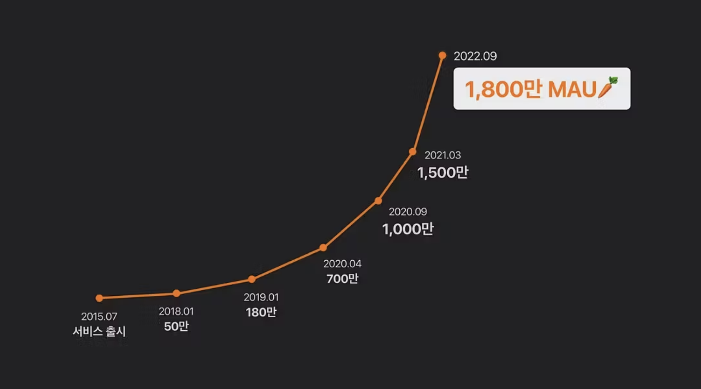 <br>

사업을 구상하게 된 계기는 맘카페에서 시작했다. 지역의 엄마들이 중고 물품을 직거래하는 모습을 보고 사업을 구상했다고 밝혔다. 카페에서 이루어지던 행위를 플랫폼으로 옮긴 것이다.

사업의 시작은 판교 기업을 대상으로 한 물품 교환, 직거래 서비스 앱으로 이름은 판교장터였다. 하지만 기업이 아닌, 주변 거주자들이 물품 직거래가 가능하냐는 문의전화가 계속 옴에 따라 동네에서 중고 직거래 할 수 있는 지역 기반 중고거래 스마트폰 애플리케이션 서비스로 변경했다. 

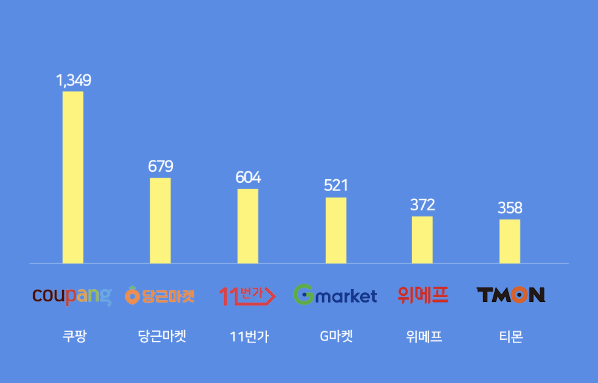 <br>
또한 당근마켓은 2020년 와이즈 앱에서 발표한 결과에 따르면 11번가, G마켓을 제치고 이커머스 분야 2위를 차지하기도 하였다. 

그리고 당근마켓은 2019년 KARROT이라는 이름으로 영국 진출을 시작으로 미국 뉴욕 맨해튼, 캐나다에서 베타 서비스 하였고 2021년 2월 일본에도 진출하였다. 

<br>

# 서비스 분석

## ▶ 서비스 미션 & 비전 <br>

당근마켓 김용현 대표는 “중고거래를 넘어 무너진 지역 커뮤니티를 인공지능(AI)과 모바일 기술을 이용해 재건하는 게 당근마켓의 지향점”이라고 강조했다. 

또한 중고거래로 시작해 지역 커뮤니티를 연결하니 동호회, 아이 또래 모임, 가사 도우미 구인, 동네 가게 소식지, 아르바이트 모집 등 무수히 많은 연결이 가능하여 최종적으로는 하이퍼로컬 플랫폼으로 나아가고자 한다고 밝혔다. 네고왕에서도 당근마켓은 “지역 커뮤니티”의 활성화가 목표며, 미래에는 위아래집 정도로까지 거리를 줄이는 게 목표라고 밝힌 적이 있다. 

<br>

## ▶ 서비스 목표 & 전략 <br>

### 🔸 초창기 당근마켓의 목표  🔸

사업 초반에 작은 시장에서 시작해 고객을 어떻게 만족시켜야 하는지에 집중했다. 이후 지역 주민을 고객층으로 타깃한 만큼 가입과 상품 등록을 최대한 쉽게 할 수 있도록 했다. 사용자 피드백을 통해 문제를 빠르게 해결하다 보니 지금의 당근마켓이 탄생했다.
<br>

### 🔸 현재 당근마켓의 목표  🔸

”지역이란 키워드를 중심으로 플랫폼에서 연결할 수 있는 다양한 서비스를 고민 중이다. 동네 구인·구직, 고도화된 부동산 거래 서비스를 일부 지역에서 실험 중이며 구매자와 판매자 간 시간이 안 맞는 문제를 해결하는 방안도 고민 중이다.”

수익 창출 측면에서는 서비스를 지역이라는 특성으로 재해석한 하이퍼로컬 시장은 당근이 오랫동안 연구하며 개척해온 분야기 때문에 풍부한 데이터와 경험이 있다며 “비즈니스 프로필 등 각종 솔루션과 결합해 동네 서비스가 활성화된다면 궁극적으로는 수익으로도 이어질 수 있을 것”이라고 내다보고 있다. 

2020년 인터뷰에 따르면 '추후 배달·주문 서비스까지 확장할 계획도 있느냐'고 묻는 질문에 "아직은 모르겠지만, 가능성은 있다"며 "우선은 청소·가사도우미 등 구인·구직 서비스, 부동산 중개 서비스 등을 계획하고 있다"고 예고했다. 2023년 현재 구인·구직 및 부동산 서비스는 진행하고 있는 것으로 보아 


<br>

## ▶ 서비스 구조

### 🔹 서비스 주체 🔹
구매자, 판매자, 서비스 운영자

### 🔹 서비스 현황 🔹
전국을 6500여개의 구역으로 나누어 동네 주민끼리 중고물품을 판매하고 구매할 수 있도록 서비스를 지원하고, 더 나아가 지역 정보를 공유하는 커뮤니티 역할을 한다. 2021년 8월 기준 월 이용자수 1,500만, 주간 이용자수 1천만을 돌파했으며, 가입자수 또한 2100만명을 넘어섰다.

```
일단 메인으로 밀고 있는 중고마켓
```

```
그 외에 동네 생활 및 내 근처(동네가게)
```

### 🔹 수익구조🔹
현재 당근마켓의 매출의 99%는 광고에서 나오고 있다고 봐도 무방하다. 당근마켓의 기업가치는 무려 3조원. 지금도 MAU는 계속 증가하고 있다. 그러나 당근마켓의 무수수료 영업방침은 사용자당근마켓의 영업적자는 352억원으로(2021년 기준), 전년과 비교해 적자 폭이 두배 이상 늘었다. 영업손실에 대한 우려감이 커졌는지, 지난 6월부터 프랜차이즈 기업의 광고 및 비즈프로필을 허용하기 시작했다.

<br>

# 서비스 문제점 및 개선방향

## ◼ 비즈니스 문제점 ◼
```
내근처(동네가게)에 대한 정보 및 접근성 문제
```
 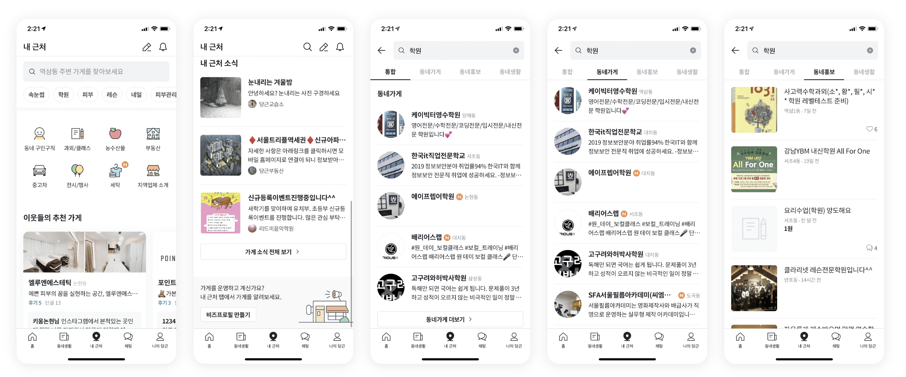 <br>
동네가게의 경우 내근처라는 탭을 통해 들어갈 수 있으며, 동네에 대한 정보들을 보여준다. 예를 들면 음식점, 학원 등을 검색할 수 있는데 검색해보면 이름, 간단한 정보 외에 나오는 게 없다. 동네 특화 앱인데, 다른 검색 포털에 비해 메리트가 있는 것이 없는 거 같다. 

```
당근마켓 위치조작하는 방법
```
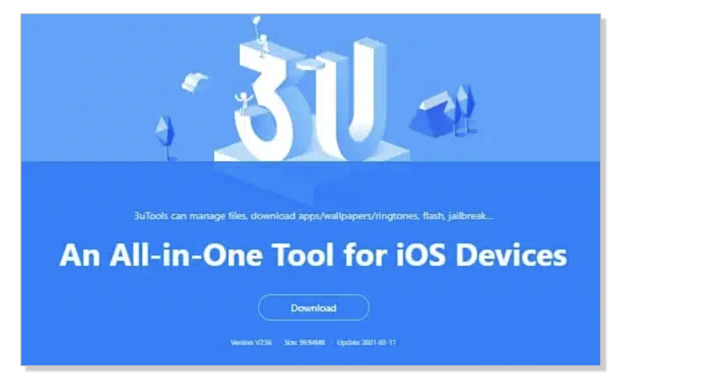 <br>
동네 인증을 우회할 수 있는 방법들이 존재한다. 

또한 동네 하나 정도 규모에서는 레어한 물건은 사기도 팔기도 어려우며 모든 동네의 거래 가능 범위가 합리적으로 나뉘어 있는 것도 아니라서 문제로 제기되고 있다. 또한 여러번 타 지역 동네 인증시, 30일동안 동네인증이 차단되어 판매자와 대화할 수 없으며 이 점을 비판해도 동네 이웃과 거래하는 서비스라는 말과 고객센터 Q&A를 보라는 소극적인 답변만 남겨 놓았다.

```
사용자 문제
```
중고물품을 판매하는 플랫폼이다보니 사기꾼, 무응답, 비매너 문제가 심각하다. 또한 제품의 판매를 위해 기스 및 불량 사항에 대해 전혀 없다는 식으로 설명되어 있는 경우 의심을 해봐야 한다. 특히 전자기기의 특성상 흠집 하나 없이 사용하기란 대단히 어려우며, 직거래라도 하자에 대해 구매자가 일일이 파악하는 것 또한 어렵다. 때문에 실제 불량이 있는 기기에 대해 구매자가 환불을 요청해도 판매자는 잡아떼기 십상이다. 

그리고 동네 근처 직거래에 최적화된 당근마켓 특성상, 코앞에서 무료나눔을 해주는 게시글을 찾기 매우 간편하여 무료나눔 상품만 받으러 다니는 사람들이 많다.

중고물품이 아닌 동네생활의 경우 특히 사이비 종교인들이 친목 도모할 것처럼 굴거나 심리나 MBTI 등의 주로 청소년 및 2030대 관심사를 이용해 기회를 노린다.

```
소극적인 CS대처
```
우선 비매너로 신고를 당해서 풀어달라는 사람들이 많은데, 억울하게 당한 경우도 당근마켓 측에서는 자동화 서비스를 쓰고 있어서 해줄 수 있는게 없다는 답변을 받은 사람들이 많다. 

또한 물건 대금 지급 후 탈퇴한 사용자에 대해 클레임을 걸었더니 "그 사용자가 다시 계정을 가입하면 알려주겠다. 사기문제는 경찰서에 가봐라" 라는 답변이 돌아왔다. 직거래를 지향하지만 10번 중 5번은 택배거래를 하게되는데 택배거래 사용자에 대한 사기 관련 클레임 대처법도 생각해봐야 할 거 같다. 

또한 고객센터 전화번호가 있지만 TTS가 받으며 상담을 받지 않는다고 알려주면서 전화를 끊어 판매자가 허위신고를 당해도 제대로 처리를 해주지 않는다.

<br>

## ◻ 서비스 문제점 (리서치 및 직접 사용) ◻

```
홈화면 추천 서비스 문제
```
홈화면에는 간단하게 상품들이 정렬되어 있는데 이 기준이 당근마켓 내의 유저 데이터를 통해서 도출된 결과인 거 같다. 그런데 별로 원하지 않는 상품들이 전개되어 있어서 불편함이 있으며, 검색 아이콘, 햄버거 메뉴, 알림 설정으로 이루어진 아이콘 탭도 카테고리를 검색하는데 찾기 어렵다는 사람들이 존재한다.  

```
여전히 로컬 플랫폼이 아닌 중고거래 플랫폼
```
동네생활에 들어가면 주민들이 쓴 글들을 볼 수 있는데 카테고리가 거의 나뉘어지지 않아 방대한 글들이 정렬되고 있으며, 특정 검색어를 검색하면 왜 글이 나오다가 중간에 모임이 뜨고 다시 글이 나오는 건지 모르겠다. >> 뭐가 문제냐면 밑에는 글이 더이상 없는 줄 알았다. 

그리고 소모임 관련된 탭이 있는데 단체 채팅방이 없어서 글을 올리고 댓글 올릴 수 있는 네이버 카페같은 형태를 취하고 있다. 심지어 네이버 카페도 단체 채팅방이 있다. 결국 심도있는 만남이나 활동을 위해서는 카카오톡으로 넘어갈 수 밖에 없다. 

```
카테고리 분류 및 키워드 추천 문제
```
카테고리가 단순하게 분류되어 있어서 탐색이 어려운 문제가 있으며, 번개장터는 '낫유어로즈'라는 여성 패션 브랜드를 검색하면 '페인오어플레져', '쓰리타임즈'등 연관어로 사람들이 사거나 검색하는 브랜드가 나오는데 당근마켓은 추천시스템이 도입되어 있지 않아 브랜드를 모르면 검색하기가 어렵다. 

```
PC 지원 문제
```
당근마켓은 모바일 플랫폼으로 시작하였기 때문에 PC 지원이 부실하다. 그리고 PC로 상품을 검색하면 전국구를 대상으로 물품이 나온다. 그런데 유명한 브랜드를 검색하면 전국구로 상품이 나오는데, 인지도가 낮은 브랜드를 검색하면 검색결과가 없다고 뜬다. 당근마켓 앱에서는 검색이 되는데 웹에서는 검색결과가 없다는 아이러니가 펼쳐진다.  

## ◻ 서비스 문제점 (VOC모음집) ◻

```
키워드 알림 개선
```
키워드 알림 기능의 개선이 필요해 보인다. 필요한 물건의 예상 가격대와 알림 시간대를 정할 수 있으면 더 좋겠다.

```
내 상점 검색 기능
```
내 상점 검색 기능, 예를 들어 구매자님이 구매하신 상품이 200, 250번째 상품이라면 판매완료로 변경하기 위래 스크롤을 여러번 내려야하는 단점이 있다.

```
검색어 제외 기능
```
검색할 때 검색어 제외 기능이 생겼으면 좋겠다. '아이폰'을 찾아보는데, 아이폰이 아니라 아이폰 '케이스'가 나오는 것이 불편했다.

```
동영상 기능
```
동영상을 올릴수가 없다는 면에서 불편핟. 내가 물건을 팔때나 살때, 작동 여부 또는 필요한 중요 설명을 동영상을 통해 전달된다면 사는사람, 파는사람이 좀 더 정확하게 파악할수 있을거라 생각된다. 

```
좋은 매물 파악의 문제
```
좋은 매물 빨리 가져가는게 좋은거지 이미 거래끝나거나 남들이 다 달라 붙어서 예약중인거 추천 매물로 보여주는 이유가 뭔지 모르겠다.

```
동네 기준 문제
```
지역설정 범위가 조금 더 넓었으면 좋겠다. 서울 사는 사람으로써 왠만한 곳은 1시간 이내에 갈 수 있는데 실질적 거리 때문에 원하는 장소 분과 채팅 못하는게 좀 많이 불편하다. 

<br>

# 경쟁 서비스 분석
서비스를 개선하기 전에 국내외 플랫폼 현황에 대한 조사를 해봤다. 

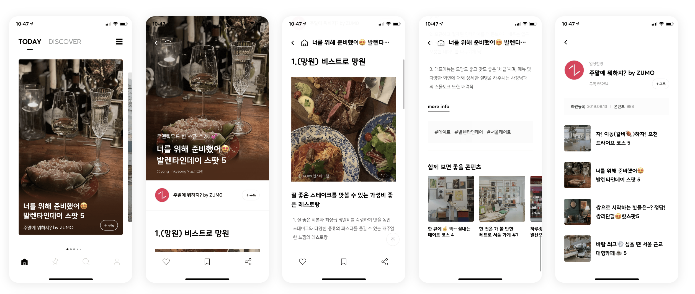 <br>
라이프 플러스는 일상에 도움이 되는 이야기를 공유하는 곳인데, 동네에 좋은 스팟 이런 것을 콘텐츠처럼 정리하는 것도 괜찮은 레퍼런스 인 거 같다. 

<br><br>

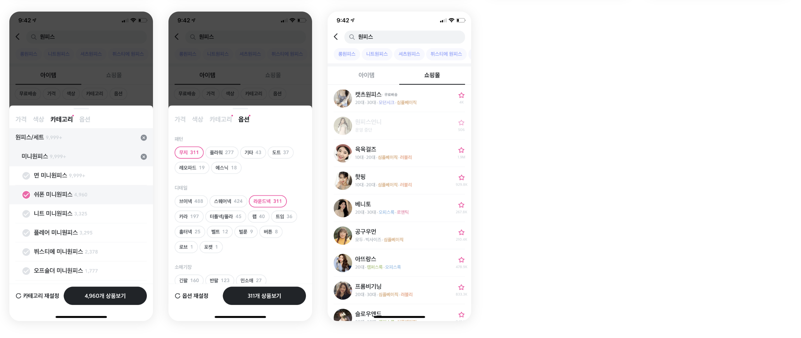
지그지그 앱의 카테고리 분류인데, 당근마켓의 경우 1depth로 이루어진 카테고리를 가지고 있어 물건을 탐색하기가 어렵다. 지그재그는 여성 쇼핑몰만을 다루는 전문몰이라 이렇게 깊게 뎁스를 가지고 가지는 않아도 카테고리 분류를 하는 데 좋은 레퍼런스 인 거 같다. 

<br><br>


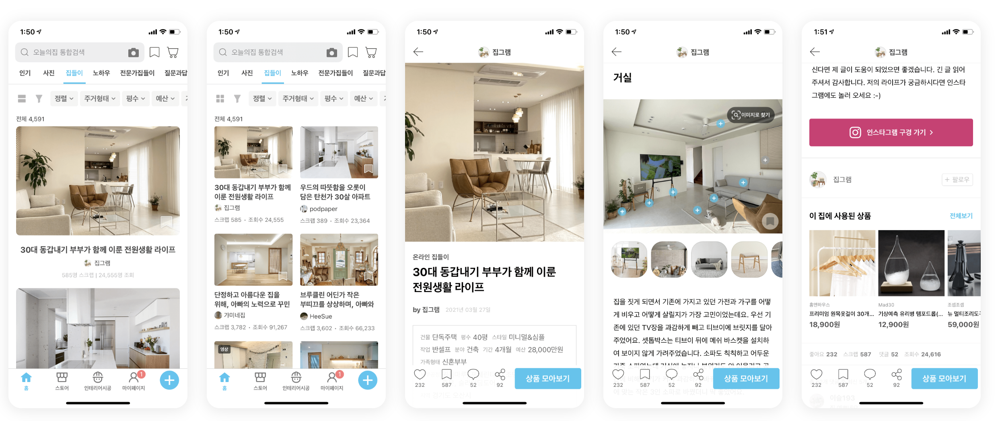
오늘의 집도 커뮤니티가 강하기로 유명한데, 네이버 카페의 레몬테라스와 비슷하다. 홈 인테리어를 자랑하고 서로 칭찬을 주고 받는 곳이다. '온라인 집들이' 서비스가 특이 눈에 띄인다.

<br>

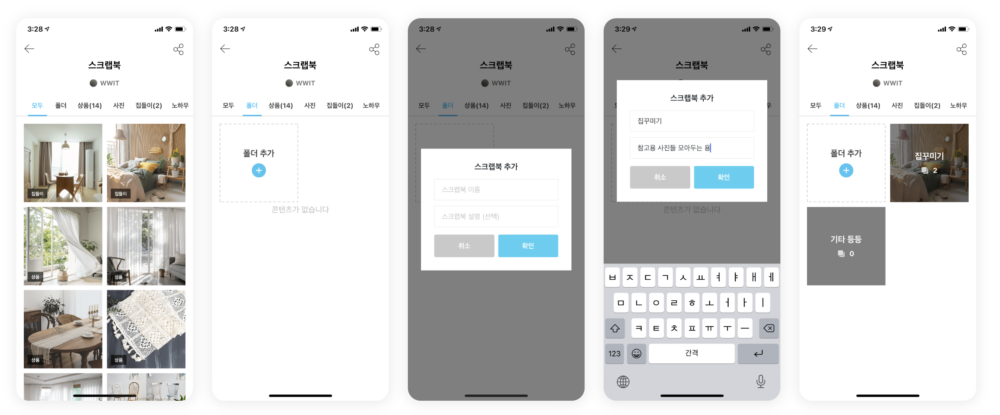
또 스크랩북 형태를 통해 앨범처럼 저장할 수도 있다.

<br><br>

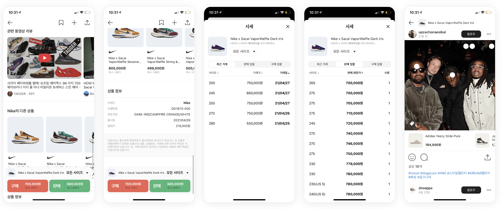
크림은 네이버에서 만든 신발 리셀 플랫폼인데, 시세 조회 기능이 있어서 가지고 왔다. 중고나라도 주요 물품에 대한 시세조회 기능이 있었는데 당근마켓도 중고 판매가 가장 메인으로 밀고 있는 만큼 시세조회가 있었으면 좋겠다.

<br><br>

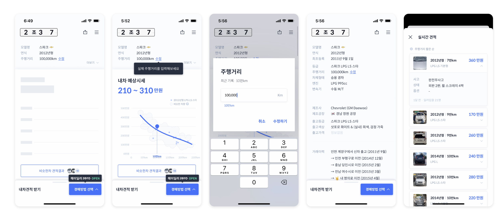
헤이딜러의 시세조회, 중고품은 교환이나 환불이 거의 불가한 만큼 사는데 신중을 기해야하는데 헤이딜러의 예상 견적 시스템이 좋아보여 가지고 왔다.

<br><br>

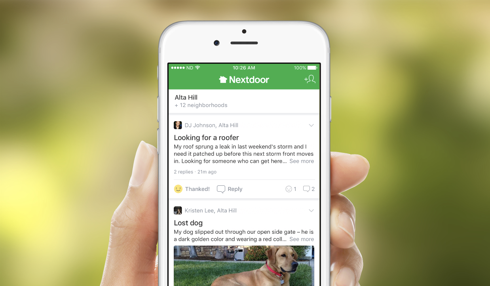
그 외의 해외 서비스로는 동네를 기반으로 구인·구직·부동산 중개·중고거래 등의 서비스를 제공하는 미국의 '넥스트도어'가 있는데 당근마켓이랑의 차이는 커머스보다는 커뮤니티에 특화된 앱이라고 한다. 

<br>

그외의 타국의 서비스들도 있다. 중국에서는 마을 주민들이 편리하게 공동 구매를 진행할 수 있는 온라인 플랫폼인 ‘둬둬마이차이’가 출시됐는데 현재 200개가 넘는 도시에서 서비스중이다. 인도에서는 지역 사건사고를 중심으로 소통하는 사회관계망서비스(SNS)인 ‘퍼블릭’의 이용자가 5000만명을 넘었고, 일본의 ‘피아짜’는 코로나19 기간에 동네 가게를 홍보하는 도구로 활용됐다. 영국 ‘올리오’는 집에서 재배한 채소나 너무 많이 산 식재료를 이웃에 판매하는 서비스다.

<br>

# 서비스 개선안 (비즈니스)

## CS 처리문제
현재 당근마켓의 고객센터는 하단 네비게이션의 나의 당근으로 들어가 자주 묻는 질문에 들어가서 하단으로 스크롤을 내리면 나오는 문의하기에서 찾을 수 있다. 그리고 이 고객센터는 메세지로만 운영이 된다. 비슷한 플랫폼인 번개장터, 크림, 쿠팡 모두 고객센터 전화를 이용할 수 있으며, 중고나라는 대표번호 및 인증셀러에 대한 전화 클레임 창구가 존재한다. 그러나 당근마켓은 직원과 전화로 연결할 수 있는 방법이 아예 존재하지 않으며 인건비 절약 측면에서 이 같은 결정을 내렸다고 하더라도 당장의 사기를 당했는데 메세지 남기고 기다리라는 식의 운영은 개선되어야 할 필요가 있다고 생각한다. 
<br>

# 서비스 개선안 (중고 서비스)

## 홈화면 추천 서비스 문제
당근마켓의 홈화면은 깔끔하긴 하지만 최신인지, 추천순인지 뭔지 모를 상품들의 나열로만 홈화면이 구성되어있다. 

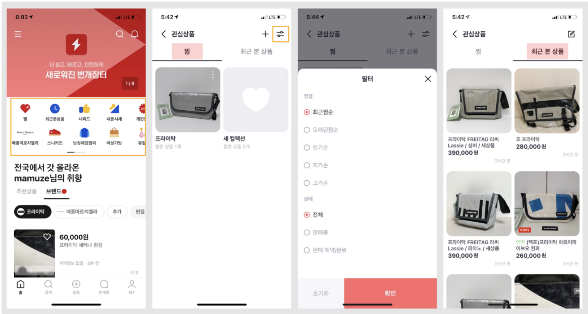

번개장터처럼 추천상품, 브랜드별 상품을 개인화에 맞게 해놓으면 조금 더 납득할 수 있는 상품들의 나열이 되는데, 당근마켓은 자체 AI를 통해 소비자에게 맞춘 상품을 구성했다고는 하지만 어떤 관점에서 구성했는지 잘 모르겠어서 쇼핑 경험의 저하가 된다. 실제로 일주일에 세번 이상 당근마켓을 사용하는 본인도 홈화면의 상품보다는 직접 브랜드를 검색해서 사용하곤 한다. 

<br>

## 카테고리 분류 및 키워드 추천 문제
당근마켓은 앞서 지그재그에서도 말했다시피 물품을 사기에 카테고리 분류가 빈약하다는 단점이 있다. 또한 키워드 추천이나 실시간 인기 검색어 등의 큐레이션이 부족해 키워드를 정확히 알지 못하면 상품 구매가 불편하다.

<br>

## 동영상으로 볼 수 있는 상품 정보
당근마켓 뿐 아니라 중고마켓들에서 동영상으로 상품을 볼 수 있는 기능을 찾아보기 힘들다. 아이맥용 키보드를 직거래로 구매했는데 고장이나 배터리 여부를 확인하기 힘들었던 경험이 있다. 이에 간단한 영상을 첨부할 수 있도록 하면 좋을 거 같다.

<br>

## 시세조회
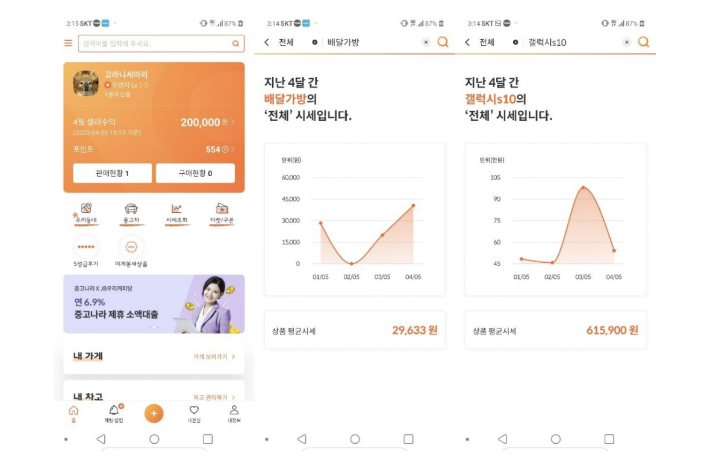
판매하는 사람도, 구매하는 사람도 합리적인 가격에 상품을 거래할 수 있도록 시세 조회기능이 추가되면 좋겠다. 실제로 당근마켓에 많은 명품 제품 및 전자 제품이 올라오는데 합리적인 판단을 하기가 힘들다.

<br>

## PC지원
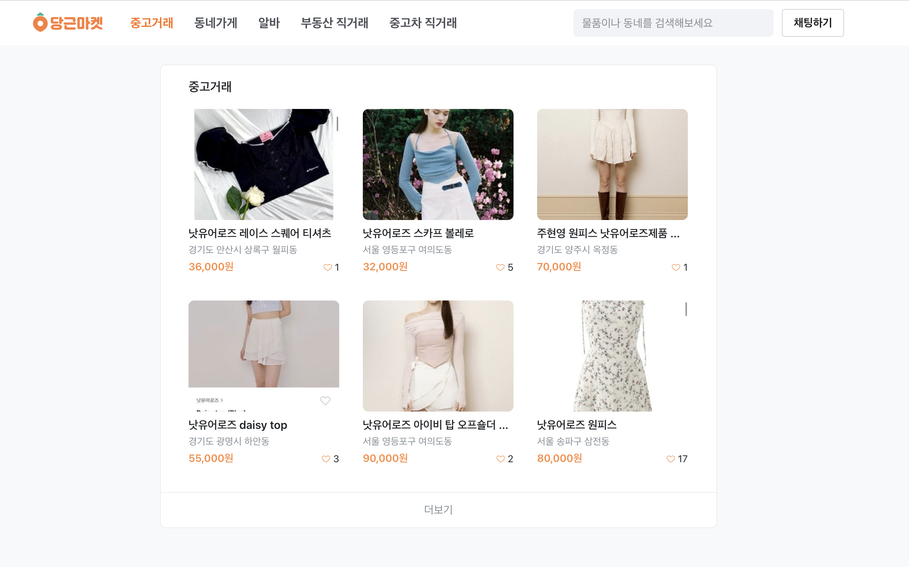
전국 물품이 다 나오는 당근마켓.....

<br>

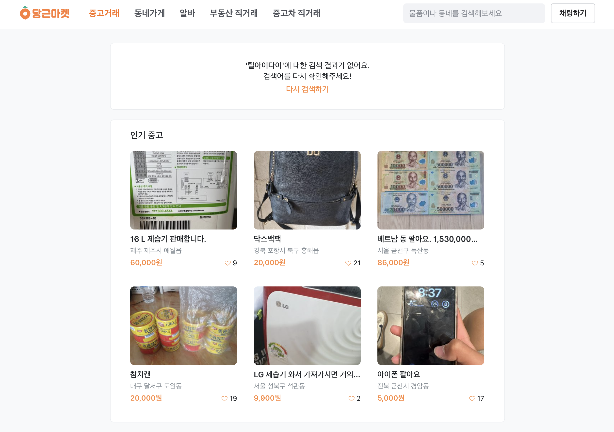
게다가 PC는 물품 수가 많은 브랜드만 나오고 인지도가 적은 브랜드는 안나온다.
그림에 검색한 틸아이다이를 당근마켓 앱에서 검색하면 나온다.

<br>

# 서비스 개선안 (동네생활,내근처)

## 소모임 지원을 위한 단체 채팅방

네이버밴드, 네이버카페, 소모임 앱 모두 단체 채팅방을 운영하는데에 비해 당근마켓은 1:1채팅만 가능하고 우리동네 탭에서는 글쓰고 댓글 다는 것으로 이웃주민들과 소통이 가능하다. 

소모임을 지원하고 있지만 단체 채팅방 지원이 안되어있어 결국 심도있는 이야기를 하기 위해서는 카카오톡으로 넘어갈 수 밖에 없다. 이에 단체 채팅방 도입이 필요하다.

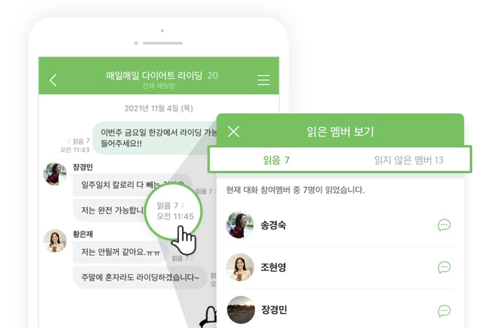

## 동네생활 UX 개선

동네 생활을 들어가면 상단에 소모임 탭이 있고 아래에 필터처럼 생긴 요소와 게시글들이 있다. 모임이나 필터를 누르면 다른 뎁스로 들어가게 되는데 직관적이지 않았다. 좋은 예시로 지식인 레퍼런스가 있는데 개선이 필요해보인다. 

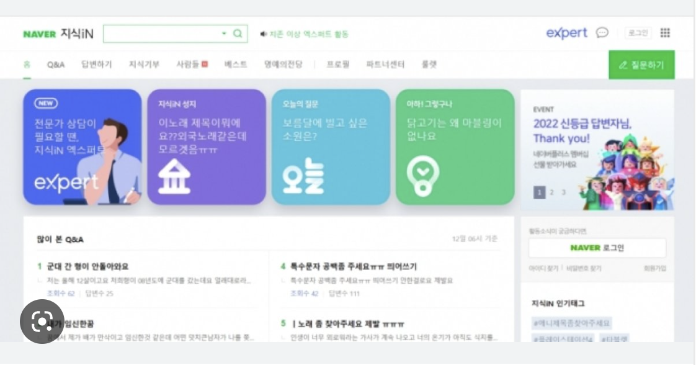

## 상점에 대한 콘텐츠 제작

미국의 당근마켓, 동네 앱으로 불리는 '넥스트도어'는 동네 인근 상점들을 수익화의 대상으로 삼고 있다. 당근마켓은 사용자의 편의는 고려하지만 상점들에 대해서는 좋은 콘텐츠를 제공하고 있지 않다. 오늘의 집처럼 상점과 동네 주민을 연결하는 콘텐츠를 제작하여 수익화의 방향을 이끌어 낼 수도 있을 거 같다.

<br>

# 당근마켓 최종 결론

CS문제는 서비스 기획 측면에서 해결하기 어려워보이며, 동네 기준도 정책 문제로 해결해야 한다. 그래서 나는 앞서 말한 문제점과 개선방향을 토대로 홈화면과 동네생활, 내근처, 검색과 카테고리의 UXUI를 개선하여 앱 체류시간 및 사용자 편의를 증가시키고자 한다.

또한 수익모델 개선을 위해서 내동네의 콘텐츠 고도화 신규 기능 도입을 통해서 당근마켓의 과제 중 하나인 수익모델을 개선해보고자 한다. 

이외에 PC버전 리뉴얼을 할 수 있을 거 같다.
